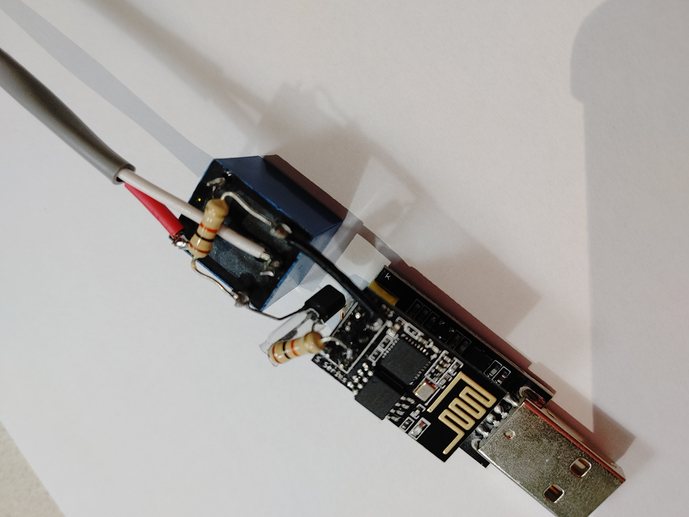
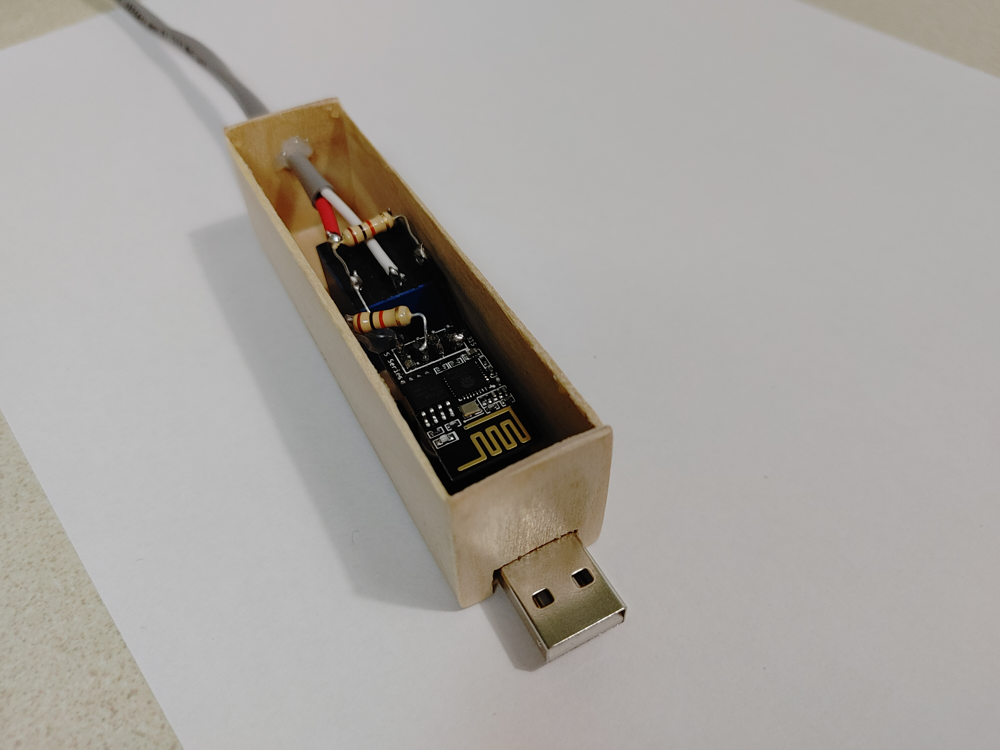
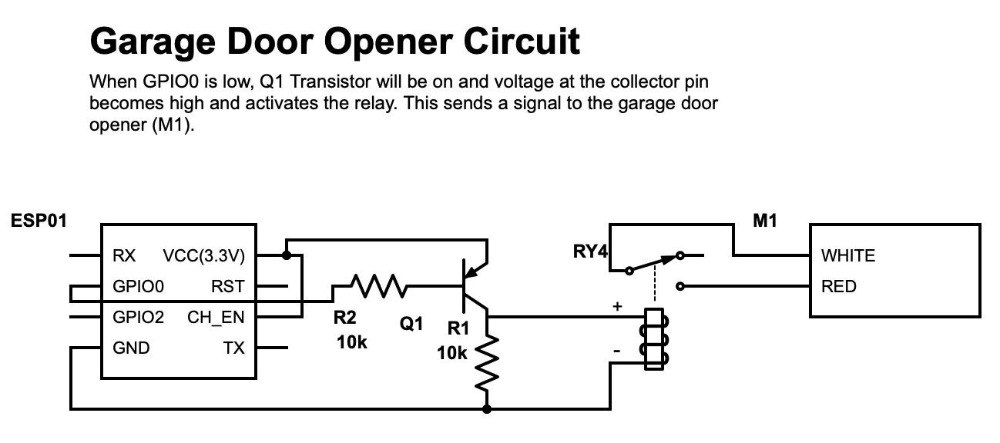
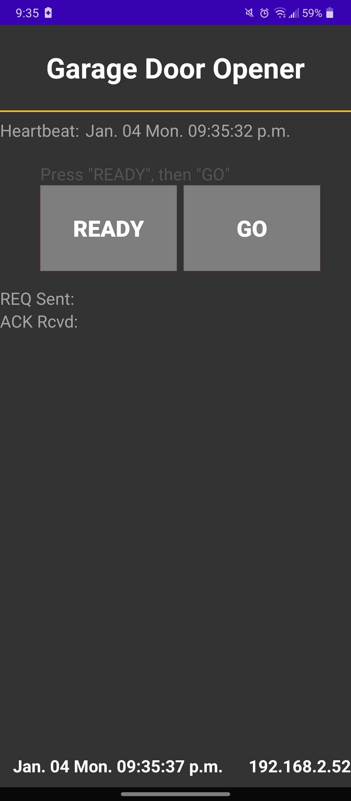

# Garage Door Opener Module
## General Description
The ESP01 Module is wired to the garage door opener. When the user taps a button on the app, the app sends a code via MQTT to the ESP01 Module, which then sends a one second pulse to the garage door opener, which opens the garage door. The ESP01 module must be connected to your home wifi network for the MQTT communication to work, however, the phone with the app can be connected to the internet in any way including using cellular data or wifi.

## Description of ESP01 Module 
The ESP01 Module is subscribed to a MQTT topic. When it receives a code via the companion app, the ESP01's GPIO0 pin will be set low for one second. GPIO0 being pulled low will activate the relay and will switch the normally open switch to closed. This will complete the circuit between the garage door's red terminal and it's white terminal, which will cause the door to open/close depending on the state that it is in. The module also has a asknowledgement feature. Once the code is received, the module will publish a "1" to the MQTT server to show the sender that it has successfully received their code. If the code is incorrect, the module will publish a "0". The module also has a heartbeat feature. Every 10 seconds, the module will publish "heartbeat" onto the server to show that it is still functioning.

### Materials Required
* ESP01
* ESP01 Programming Adapter
* 5V Relay
* 2x 10k Resistors
* PNP Transistor
* A USB Power Brick
* A few wires to connect everything together

### Circuit Diagram

### Notes
* When programming the ESP01 Module using the ESP01 Programming Adapter, make sure to connect the GPIO0 pin to the Ground pin to set the ESP01 to programming mode. Then disconnect it after the program is done uploading. Also, the Enable Pin has to be wired to the VCC pin to keep the module operational.
* You have to keep the ESP01 Module powered on for it to work. Since the ESP01 Programming Adapter has a USB connector, I just plugged it into a power brick and plugged the brick into an outlet beside the garge door opener. You can also choose to supply the ESP01 Module with 3.3V directly using the VCC pin and GND pin.
* My specific garage door opener activates when the red terminal is connected to the white terminal. You may want to research your own garage door opener to see how it functions as it may differ from mines. The red and white terminals on the M1 on the circuit diagram refers to the red and white terminals on the garage door opener. For my garage door opener, when the red and white terminals are connected when the door is closed, the door will open and vice versa, if the terminals are connected when the door is opened, the door will close.
* I handcrafted the wooden box that contains the entire module using popsicle sticks and wood glue. You may choose to use any container you want. 
* The power brick is one that I had lying around the house. If you don't have one, they can be purchesed online for a few dollars.
* The other wires connecting to the red and white terminals of the garage door opener are from a button switch in the garage which were already attatched to the opener before I added the wires from my module.

## Description of Android Application
The app requires the user to tap the "ready" button then tap the "go" button within 2 seconds. The two buttons are there to avoid accidental touches. The app then publishes a code onto the MQTT topic which can be read by the ESP01 module. The app will display the last time it received a heartbeat message from the ESP01 module as well as the current time accurate to the second. After sending a request to open the door to the ESP01 module, it will display "Success" if the ESP01 module recognizes the code, "Failed" if the module does not recognize the code, and the actual message itself if the response is not a "0" or "1".

Feel free to contact me at riri.hong@gmail.com if you have any questions!
